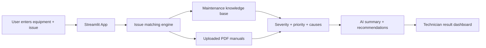

# AI Industrial Maintenance Agent

A practical AI-powered industrial maintenance assistant that helps technicians identify likely equipment faults, match them with historical knowledge-base records, and suggest safe troubleshooting steps.

## Problem Statement

Industrial plants often store maintenance knowledge across scattered files, PDFs, and past incident records. When a machine fails, technicians waste time searching for relevant information, which leads to longer downtime, missed warnings, and slower repair decisions.

## Solution

This project provides a fast diagnostic workflow where a technician can:

- Enter the machine name and problem description
- Upload PDF manuals or SOPs
- Match the issue against a structured maintenance knowledge base
- Receive likely causes, severity, priority, and recommended actions
- Review similar historical fault cases
- Use a demo-friendly web interface for quick decision support

## Supported Equipment and Fault Types

The current knowledge base includes real records for:

- Industrial Motor
  - Overheating
  - Excessive Vibration
  - Abnormal Noise
  - Failure to Start
- Conveyor Belt
  - Belt Mistracking
  - Belt Slippage
  - Excessive Noise
  - Blockage / Overloading
- Water Pump
  - Reduced Flow
  - Excessive Vibration / Noise
  - Mechanical Seal Leakage
  - Overheating

## Technology Stack

- Frontend: Streamlit
- Backend: Python
- AI reasoning: OpenAI / Groq integration
- Knowledge base: Excel workbook
- Document processing: PDF parsing with PyPDF
- Retrieval logic: rule-based matching + retrieval workflow
- Deployment: local demo / browser-ready app

## High-Level Architecture



## Project Structure

- app/main.py — Streamlit app and UI
- app/agent.py — diagnosis logic and matching engine
- core/agent.py — Groq-based diagnostic module
- core/rag.py — RAG/vector-style retrieval helper
- data/AI_Industrial_Maintenance_Knowledge_Base_Final-1.xlsx — maintenance knowledge base
- tests/test_agent.py — regression tests
- scripts/ — validation utilities

## Live Demo

The app is running locally in the browser at:

- http://localhost:8514/

## Run Locally

```powershell
cd "C:\Users\DELL\OneDrive\Desktop\AI-Industrial-Maintenance-Agent"
.\venv\Scripts\Activate.ps1
python -m streamlit run app/main.py --server.headless true --server.port 8514
```

## Example Inputs

- Industrial Motor overheating and making noise
- Water Pump reduced flow and overheating
- Conveyor Belt slippage and belt mistracking

## Team Members

Add your actual team member names here before presenting:

- Team Member 1
- Team Member 2
- Team Member 3
- Team Member 4

## Future Scope

- Real cloud deployment
- Better OCR for equipment image analysis
- More machine categories and maintenance records
- Stronger RAG + LLM-based recommendations
- Production-ready dashboard and reporting

## Final Note

This project combines industrial maintenance knowledge, AI reasoning, and practical decision support to reduce downtime and improve technician response time.
